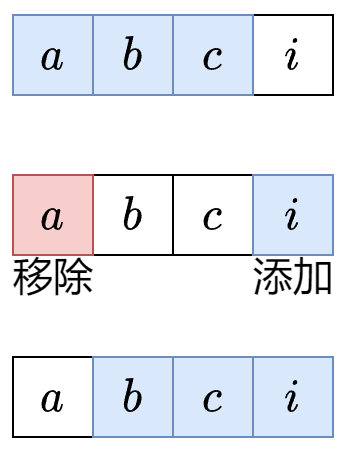

<h1>定长子串中元音的最大数目</h1>

给你字符串`s`和整数`k`.<br>
请返回字符串`s` 中长度为`k`的单个字符串中可能包含的最大元音字母数,英文中的 **元音字母** 为`a,e,i,o,u`

**示例1**
> 输入：s = `"abciiidef"`,k = 3<br>
> 输出: 3<br>
> 解释: 子字符串`"iii"`包含3个元音字母

**示例2**
>输入: s = `aeiou`, k = 2 <br>
>输出: 2 
>解释：任意长为 2 的子字符串都包含2个元音字母

**示例3**
>输入：s = `leetcode`,k = 3
>输出: 2
>解释: `lee`,`eet`和`ode`都包含两个元音字母

<h2>滑动窗口</h2>

我们要计算所有长度**恰好为k**的子串中，最多可以包含多少个元音字母。<br>
不考虑暴力枚举$o(nk)$,对于下图的字符串abci,假如我们已经计算出了子串`abc`的元音个数，那么从子串`abc`到子串`bci`,只需要考虑移除（离开窗口）的字母a是不是元音，以及添加(进入窗口)的字母`i`是不是元音即可，因为中间字母`b`和`c`都在这两个子串中。



<h3>举例</h3>

s = `abciiidef`, k = `3`

1. 从左到右遍历
2. 首先统计前k - 1 = 2个字母的原因个数，这有 1 个
3. `s[2] = c`进入窗口，此时找到了第一个长为 `k` 的子串 `abc`,现在元音个数有`1`个，更新答案最大值。然后`s[0] = a`离开窗口，现在元音个数有`0`个
4. `s[3]=i`进入窗口，此时找到了第二个长为`k`的子串`bci`,现在元音个数有`1`个，更新答案最大值，然后`s[1]=b`离开窗口，现在元音个数有`1`个
5. `s[4]=i`进入窗口，此时找到了第三个长为`k`的子串`cii`，现在元音的个数有`2`个，更新答案最大值，然后 `s[2]=c`离开窗口，现在元音个数有`2`个
6. `s[5]=i`进入窗口，此时找到了第四个长为`k`的子串`iii`,现在元音的个数有`3`个，更新答案最大值，然后`s[3]=i`离开窗口，现在元音的个数有`2`个
7. `s[6]=d`进入窗口，此时找到了第五个长为`k`的子串`iid`,现在元音的个数有`2`个，更新答案最大值，然后`s[4]=i`离开窗口，现在元音的个数有`1`个
8. `s[7]=e`进入窗口，此时找到了第六个长为`k`的子串`ide`,现在元音的个数有`2`个，更新答案最大值，然后`s[5]=i`离开窗口，现在元音的个数有`1`个
9. `s[8]=f`进入窗口，此时找到了第七个长为`k`的子串`def`,现在元音的个数有`1`个，更新答案最大值，遍历结束

<h3>定长滑窗套路：入-更新-出</h3>

1. 入：下标为`i`的元素进入窗口，更新相关统计量，如果`i<k-1`则重复第一步
2. 更新: 更新答案。一般是更新的最大值/最小值
3. 出：下标为`i-k+1`的元素离开窗口，更新相关统计量

<h3>python</h3>

```python 
class Solution:
    def maxVowels(self,s:str,k:int) -> int:
        ans = vowel = 0
        for i, c in enumerate(s):
            #进入窗口
            if c in "aeiou":
                vowel += 1
            if i < k - 1: #窗口大小不足 k
                continue 
            #更新答案
            ans = max(ans,vowel)
            #离开窗口
            if s[i - k + 1] in "aeiou":
                vowel -= 1
        return ans 
```

<h2>复杂度分析</h2>

- 时间复杂度:$o(n)$，其中n是s的长度
- 空间复杂度:$o(1)$,仅用到若干额外变量


