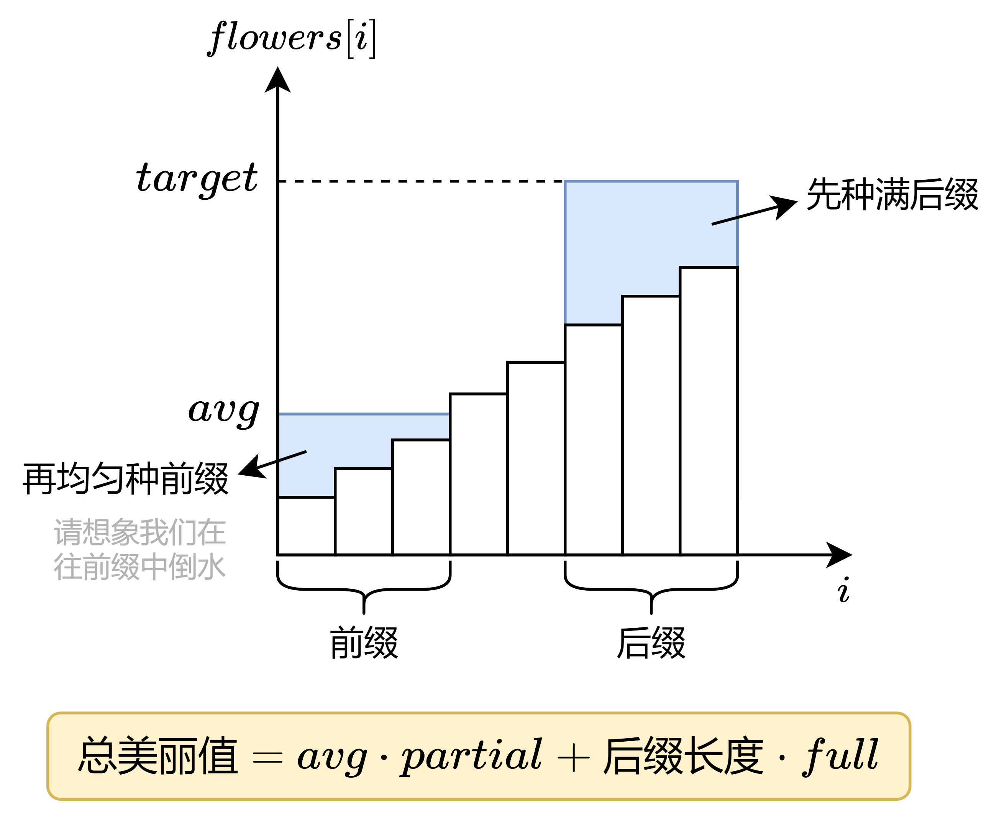

<h1>2234.花园的最大总美丽值</h1>

Alice 是 `n`个花园的园丁，她想通过种花，最大化她所有花园的总美丽值<br>

给你一个下标从**0**开始的大小为`n`的整数数组`flowers`，其中`flowers`是第`i`个花园里已经种花的数目。已经种的花 **不能** 移走。同时给你 **newFlowers**,表示 Alice 额外可以种花的 **最大数目**, 同时给你的还有整数`target`朵花，那么这个花园称为 **完善** 的， 花园的 **总美丽值** 为以下分数之和：

- **完善** 花园数目乘以 `full`
- 剩余 **不完善** 花园里，花的 **最少数目** 乘以 `partial`。如果没有不完善花园，那么这一部分为`0`

请你返回Alice种最多的 `newFlowers`朵花以后，能够得到的 **最大** 总美丽值


**示例1**
>输入: `flowers = [1,3,1,1]`,`newflowers = 7`,`target = 6`,`full = 12`,`partial = 1`<br>
>输出 14
>解释：Alice 可以按以下方案种花
> - 在第零个花园种 2 朵花
> - 在第一个花园种 3 朵花
> - 在第二个花园种 1 朵花
> - 在第三个花园种 1 朵花<br>
>
> 花园里花的数目为[3,6,2,2]. 总共种了2+3+1+1=7 朵花<br>
> 只有 1 个花园是完善的<br>
> 不完善花园里花的最少数目是 2<br> 
> 所以总美丽值 为 1\*12+2\*1 = 12 + 2 =14<br>
>没有其他方案可以让花园的总美丽值超过14

**示例2**
>输入: `flowers = [1,3,1,1]`,`newFlowers = 10`,`target = 5`,`full = 2`,`partial = 6` <br>
>输出: 30<br> 
>解释: Alice 可以按以下方案种花<br>
> - 在第 0 个花园种 3 朵花
> - 在第 1 个花园种 0 朵花
> - 在第 2 个花园种 0 朵花
> - 在第 3 个花园种 2 朵花<br>
>
>花园里花的数目为[5,4,5,5]。 总共种了 3+0+0+2 = 5朵花<br>
>有 3 个花园是完善的<br>
>不完善花园里花的最少数目为4<br>
>所以总美丽值为3\*2+4\*6=6+24=30<br>
>没有其他方案可以让花园总美丽值超过30<br>
>Alice可以让所有花园都变成完善的，但这样她的总美丽值反而更小
****
<h2>贪心+排序+双指针</h2>

**核心思路**：枚举把多少个花园种满（至少有`target`）朵花，剩余的花种其他花园，让最小花朵数最大

贪心的想，那些要种满的花园，原有的花朵数越多越好，这样我们能有更多的花，去增大花的最少数目.<br>

将`flowers`从小到大排序，这样`flowers`的**后缀**就是要种满的花园。<br>

枚举`i`，把`flowers[i]`到`flowers[n-1]`都种满花。剩下要解决的问题是最大化花的最少数目<br>

例如`flowers = [1,3,5,7,10,10]`,还剩下`9`朵花

- 为了增大最小值，我们先把`flows[0]=1`增大，种下`2`朵花，增大到`flowers[1]=3`, 还剩下`9-2=7`。这个过程相当于往前前缀中倒水。
- 继续种花（倒水），必须把`flowers[0]`和`flowers[1]`同时增大，那么各自种下`2`，增大到`flowers[2]=5`,还剩下`7 - 4 =3`朵花
- 继续种花 (倒水),必须把`flowers[0]`,`flowers[1]`,`flowers[2]`同时增大，由于剩余的花朵数无法让这三个花园都有`flowers[3]=7`朵花，所以只能平均每个花园都种 1 朵花
- 最终,`flowers = [6,6,6,7,10,10]`,最小的花园有`6`朵花。换句话说，我们把`flowers`的一个长为`3`的前缀都变成了`6`多花

如果每次枚举`i`都经过上述流程则时间复杂度为$O(n)$,注意到随着`i`的变大，剩余能填充到前缀中花也越多，那么前缀也就越长。有单调性，我们可以用**双指针**，枚举`i`，同时维护前缀的最长长度。<br>

设在填充后缀之后,还剩下`leftFlowers`朵花可以分配。我们把这些花种到长为`j`的前缀`[0,j-1]`中。设最终最小值为`avg`，那么这`j`个花园一共有`avg·j`朵花，这个总数不能超过`leftFlowers`加上原有的花，即

$$avg\cdot j \leq leftFlowers + \sum ^{k=j-1}_{k=0} flowers[k]$$

解得avg的最大值
$$\left[ \frac{leftFlowers+\sum^{k=j-1}_{k=0}flowers[i]}{j} \right]$$

由于j是单调增大的，上式中的前缀和可以在双指针的过程中用一个变量$preSum$维护<br>
最后，根据题目给出的计算公式
$$avg\cdot partial + (n-i)\cdot full$$

计算总美丽值，更新答案的最大值。

<h3>优化</h3>
由于双指针是$O(n)$的，时间复杂度的瓶颈在排序上。如果能在排序之前特判某些情况，从而提前返回，就能减少运行时间。

 1. 如果所有花园都至少有`target`朵花，那么总美丽值只能是`n·full`
 2. 否则，如果`newFlowers`足以让所有花园都至少有`target`朵花，那么我们就只有两种策略，取其中最大值作为答案:<br>
    a. 留一个花园种`target-1`朵花，其余种满，总美丽值`(target - 1)·partial+(n-1)·full`<br>
    b. 全部种满，总美丽值为`n·full `

<h3>细节</h3>

把超过`target`的`flowers[i]`改为`target`。这一来可以简化双指针的计算，二来可以加快排序的速率，尤其是当很多`flowers[i]`都超过`target`的情况

<h2>python</h2>

```python 
class Solution:
    def maximumBeauty(self,flowers: List[int],newFlowers: int, target : int, full : int , partial : int) -> int:
        n = len(flowers)
        for i in range(n):
            flowers[i] = min(flowers[i],target)

        #如果全部种满，还剩下多少花？
        left_flowers = newFlowers - (target * n - sum(flowers))

        #没有种花，所有花园都已种满
        if left_flowers == newFlowers:
            return n * full #只能是n*full
        #可以全部种满
        if left_flowers >= 0 
            #两种策略取最大值，留一个花园种 target - 1 朵花，其余种满，或者全部种满
            return max((target - 1)*partial + (n-1)*full, n * full)
        flowers.sort()

        ans = pre_sum = j = 0
        
        #枚举 i，表示后缀[i,n-1]种满
        for i in range(1,n+1):
            #撤销，flowers[i]不变成target
            left_flowers += target - flowers[i-1]
            if left_flowers < 0: #花不能为负数，继续撤销
                continue 
            #满足以下条件说明 [0,j]都可以种 flowers[j]朵花
            while j < i and flowers[j] * j <= pre_sum + left_flowers:
                pre_sum += flowers[j]
                j += 1

            #计算总美丽值
            #在前缀[0,j-1]中均匀种花，这样最小值最大
            avg = (left_flowers + pre_sum) // j
            total_beauty = avg * partial + (n - i)*full 
            ans = max(ans,total_beauty)

    return ans
```